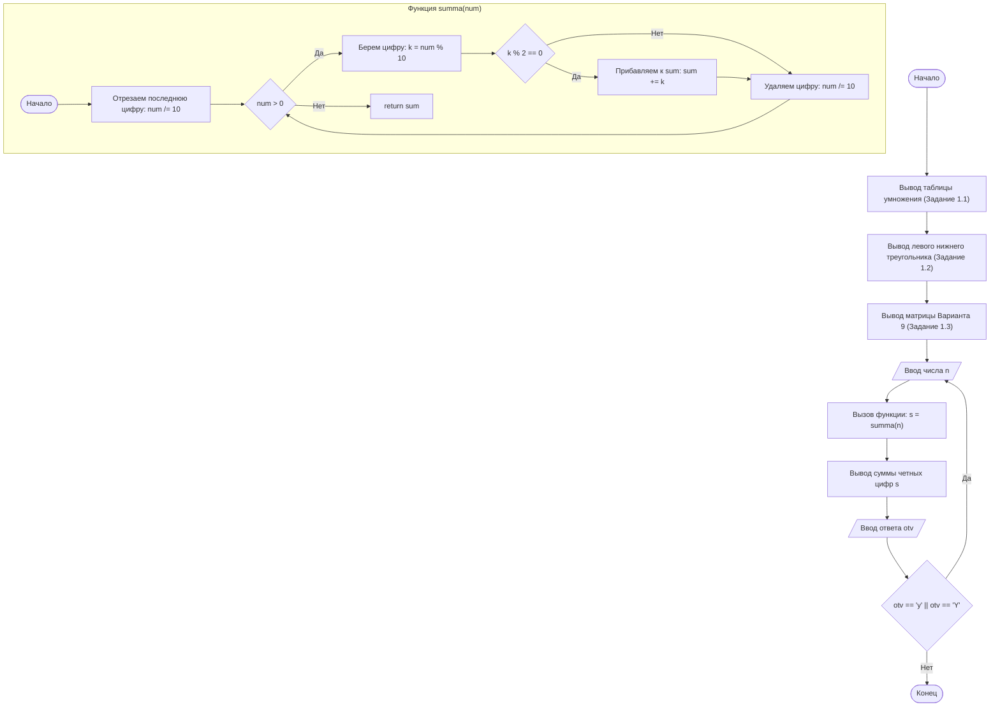

```mermaid
graph TD
    Start([Начало]) --> Task11["Вывод таблицы умножения (Задание 1.1)"]
    Task11 --> Task12["Вывод левого нижнего треугольника (Задание 1.2)"]
    Task12 --> Task13["Вывод матрицы Варианта 9 (Задание 1.3)"]
    
    %% Цикл Do-While для Задания 2
    Task13 --> InputN[/Ввод числа n/]
    InputN --> Calc["Вызов функции: s = summa(n)"]
    Calc --> PrintRes["Вывод суммы четных цифр s"]
    PrintRes --> InputOtv[/Ввод ответа otv/]
    
    InputOtv --> Cond{"otv == 'y' || otv == 'Y'"}
    Cond -->|Да| InputN
    Cond -->|Нет| End([Конец])

    %% Упрощенная блок-схема функции
    subgraph "Функция summa(num)"
        F_Start([Начало]) --> F_Cut["Отрезаем последнюю цифру: num /= 10"]
        F_Cut --> F_While{"num > 0"}
        
        F_While -->|Да| F_Mod["Берем цифру: k = num % 10"]
        F_Mod --> F_If{"k % 2 == 0"}
        F_If -->|Да| F_Add["Прибавляем к sum: sum += k"]
        F_If -->|Нет| F_Next["Удаляем цифру: num /= 10"]
        F_Add --> F_Next
        F_Next --> F_While
        
        F_While -->|Нет| F_Ret["return sum"]
    end
```
